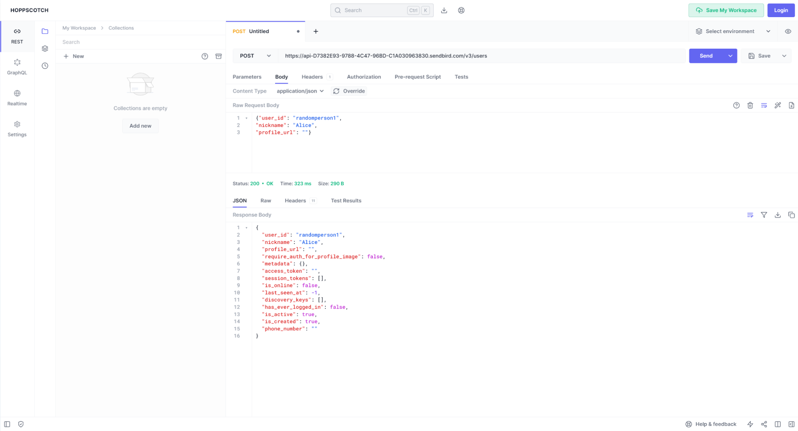
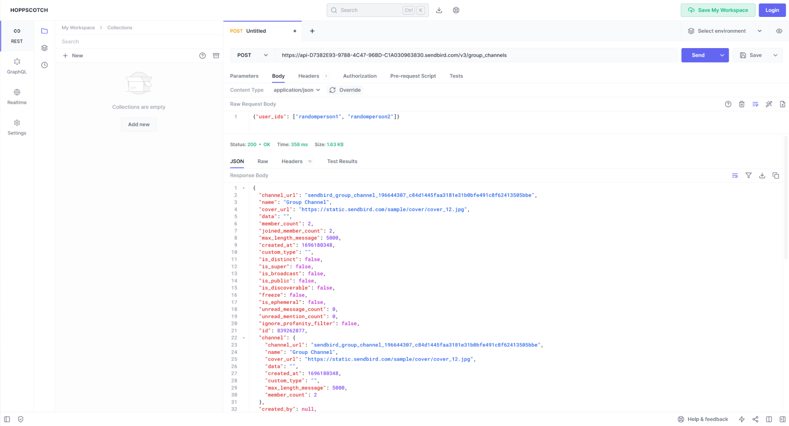
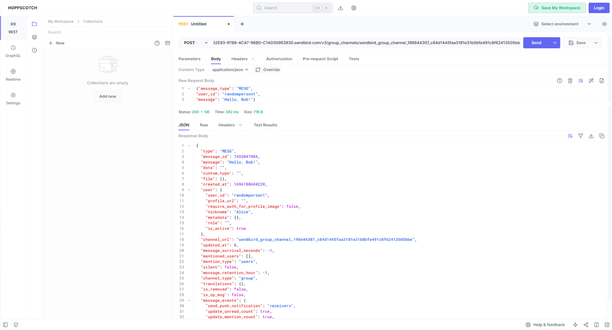
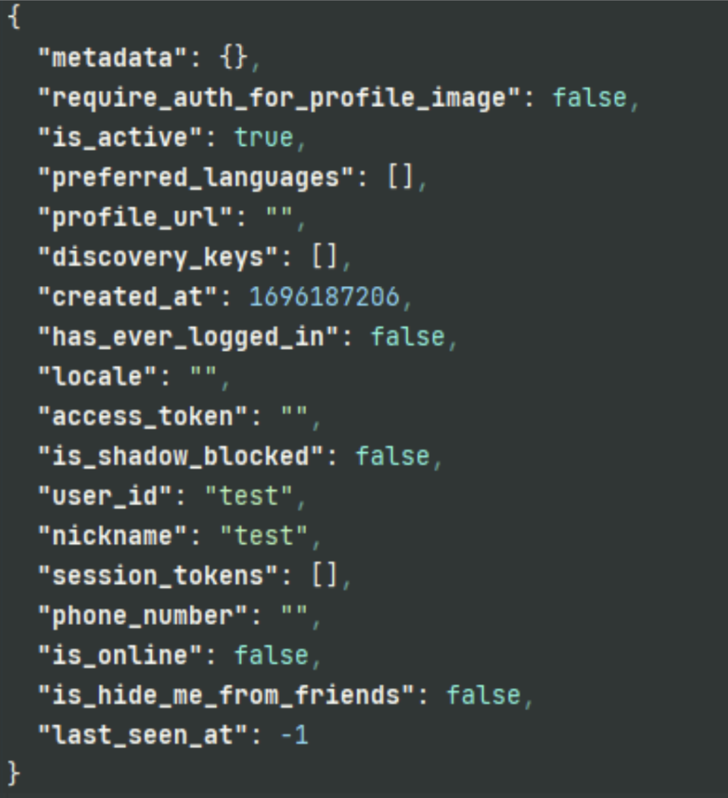
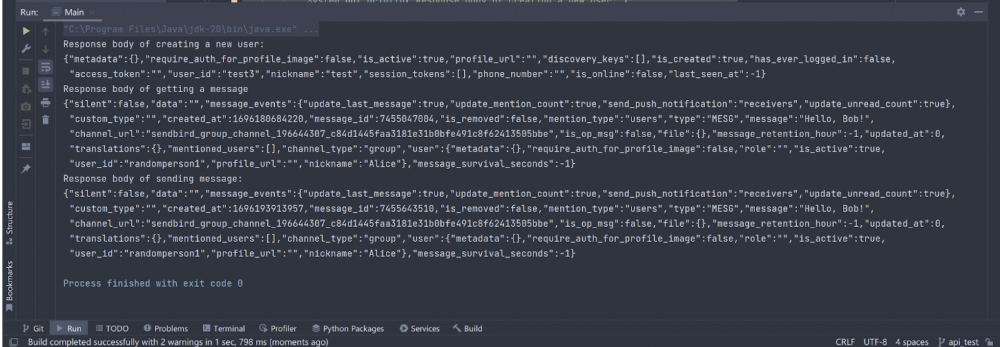

# Project_207

### Problem Domain of the Project
The problem domain that our team wants to focus on is **Tutoring and Connecting**. We want to allow an efficient matching of students with suitable tutors, assurance of high-quality chatting, and creation of friendly and virtual learning environments. By focusing on the Tutoring and Connecting domain, our team aspires to develop an innovative and effective virtual learning environment, and provide an inclusive social platform.

### Detailed Description of the Project
- Utilize **an intelligent matching algorithm** to pair students with tutors who have proven expertise in the particular courses students have taken or are taking.
- Integrate a **real-time chat feature** that enables instant communication between students and tutors, allowing for the clarification of doubts, scheduling sessions, and discussion of academic matters.
- Design a **user-friendly interface** ensuring ease of navigation, profile creation, and interaction for both students and tutors.
- Incorporate a **feedback and rating system** for students and tutors to rate each other based on the tutoring sessions, ensuring a consistent quality of tutoring services.
- Offer diverse tutoring options, including one-on-one sessions, group tutoring, or online forums for collaborative learning and discussion.

### Documentation of API used
Chatting API: SendBird

Documentation: https://sendbird.com/docs/chat/platform-api/v3/overview

### Example of Using API
Creating a user:

Creating a group channel of two users:

Sending a message to the group channel:

### Example Output of Running Java Code
Formatted json output when we call the API to get the user information 
(the user for which we want to extract information about has user_id: test).

Unformatted json output of creating a new user, getting a message, and sending a message.

### Technical Problems
We have not yet encountered any technical problems. 
